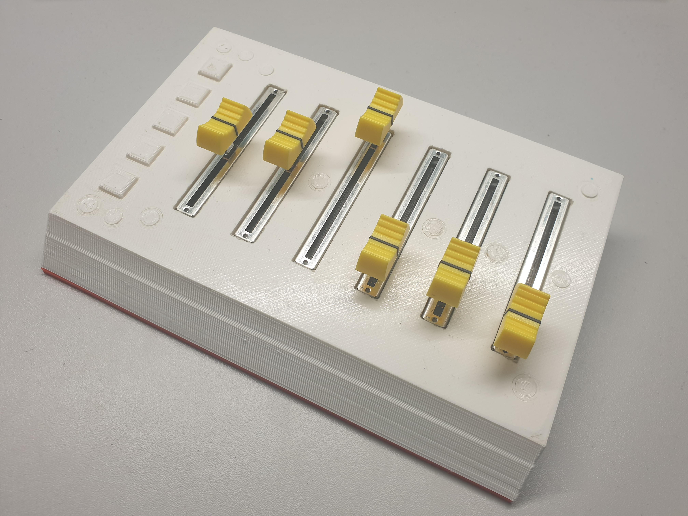
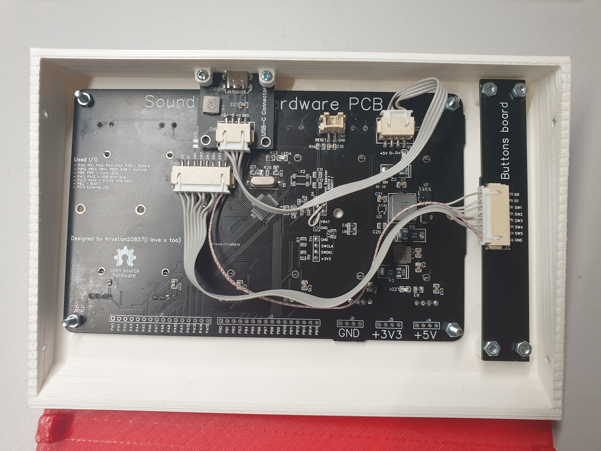

# Sound Mixer Project
Sound Mixer is a utility device designed to control volume of applications and audio devices. Audio control take place by sliders, other functions like muting, skipping/playing tracks are handled by buttons. Because controling volume of devices/audio session is platform specified the device itself cannot do it. Piece that expands capabilities of device is software running on pc which store all configuration and handles incoming data from device. Device itself can do nothing without software :). Using external software allows to even more expand capabilities of device by e.g. plugin system, etc.
## Content
* [Description](#sound-mixer-project)
* [Prototype](#prototype)
* [Software](#software)
* [Firmware](#firmware)

## Prototype
Base protorype has been alredy made and files associated with it all available there: [Sound Mixer Hardware](https://github.com/Krystian20857/SoundMixerHardware)

## Software
Sound Mixer Software is responsible for handling volume, buttons, device, and many more things. More precise and technical documentation/description is located here: [Sound Mixer Software](https://github.com/Krystian20857/SoundMixerSoftware)

Now some screenshots: 

## Firmware
The task of firmware is read values from sliders and buttons and send data through serial connection. Sound Mixer Firmware is piece of arduino code practically compatible with every arduino-based device. Firmware is fully customizable and allows to change e.g. buttons count, slider count, device name, etc. It makes firmware(and every device with it) fully compatible with desktop software. You can learn more about it there: [Sound Mixer Firmware](https://github.com/Krystian20857/SoundMixerFirmware)
